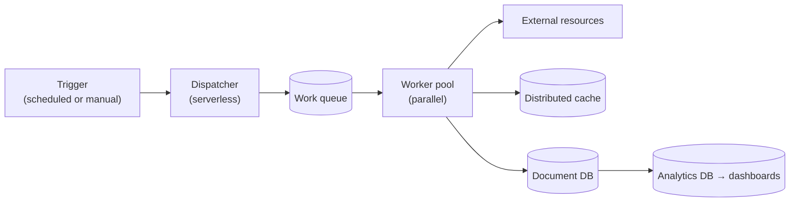
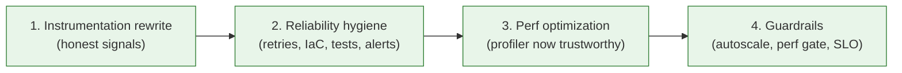
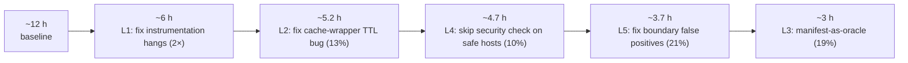

> *In this case study, several "perf problems" turned out to be observability problems wearing a costume, several "reliability problems" were really alert-design problems, and one "we need a clever optimization" moment turned out to be "the system we're validating against already publishes the answer." Your mileage will vary — but these are patterns worth checking for before reaching for harder fixes.*

## TL;DR

Eight lessons, drawn from one extended case study — a daily link-validation service that went from a **~12-hour run at ~80% success rate** to **~3 hours at ~100%** over eight months. They aren't a comprehensive theory of perf and availability; they're the recurring pitfalls we hit, generalized so you can spot them in your own services:

1. **Re-instrument before you optimize.** A profiler on broken telemetry lies.
2. **Suspect dependency wrappers — in execution order.** Per-call overhead compounds where you can't see it.
3. **Find the manifest.** Bulk descriptors beat per-item probes by ~10×.
4. **Security checks earn their cost.** Threat models name which traffic, not whether.
5. **Correctness at boundaries drives perf.** Every false positive becomes a re-validation.
6. **Treat alerts as a product.** Correlated signals page on incidents; single signals page on weather.
7. **Price reliability in engineer-hours — and start spending early.** Deferral compounds at interest.
8. **Order matters.** Instrumentation → reliability → perf → guardrails.

Each lesson below has a *why*, a *how to apply*, and a worked example from the case study.

---

## The case study, in one paragraph

A service that walks millions of hyperlinks across a large documentation corpus daily, classifies broken ones, and feeds dashboards and pull-request checks. At the start of this work, the daily run took **~12 hours**, succeeded **~80%** of the time, paged the on-call **~3×/month**, and burned ~10–14 engineer-hours/week on triage. Eight months later: **~3 hours**, **~100% success**, **~1 page/month**, **~90% less origin traffic**. The interesting story isn't the numbers — it's that none of the gains came from the things we'd have tried first.

Architecturally, it's a shape you'll recognize:



Trigger → dispatcher → queue → worker pool → cache + DB + external I/O → analytics. Any cloud batch service that fans out work over an asymmetric workload looks roughly like this. The lessons below transfer to any of them, and they appear in roughly the order we applied them; Lesson 8 explains why that order matters.

---

## Lesson 1 — Re-instrument before you optimize

**Why.** Optimization is search through a cost surface; the surface is invisible without instrumentation. Worse, telemetry runs on the hot path itself — bad instrumentation is *both* the thing hiding the bottleneck *and* a contributor to it. You can't profile your way out of this; you have to fix the floor first.

**How to apply.**

- **Audit telemetry coverage before any perf work.** For each external dependency (cache, DB, queue, third-party API), confirm you have: latency distribution per call, dependency name (low cardinality), correlation ID linking it to the request that caused it. If any of those is missing, fix it first.
- **Distinguish three signal classes** — metrics (aggregatable, low cardinality), events (per-occurrence with typed properties), traces (narrative text). Logging everything as traces forces you to reconstruct statistics by regex, which means you don't.
- **Stop logging exceptions you don't act on.** Every "expected but unusual" condition tracked as an exception is noise that hides the one you care about. The rule we landed on: an exception is logged *only if there's a runbook entry for it*. Everything else becomes a metric.
- **One event per operation, not begin/end pairs.** Begin/end requires correlation logic on the read side; a single event with a `Duration` measurement is self-contained.
- **Suspect your telemetry first when latency is mysterious.** The same wrapper that gives you per-call dependency timing is on every hot path. A heavyweight initializer, a serialized dictionary write, an inline `await` where fire-and-forget would do — these are the bugs you ship without noticing because everything still "works."

**Case study.** The temptation with a 12-hour job is to start profiling. We didn't, because the profiler would have lied. Three telemetry bugs were each individually small and collectively crippling: dependency tracking occasionally hung the loop on synchronous I/O paths that should have been fire-and-forget; a telemetry initializer re-read the `User-Agent` header off every outbound HTTP request even though an outer middleware had already attached it, doubling work and serializing on a contended dictionary; and a `WithTrackDependency` wrapper around cache calls used inconsistent dependency names (`"Get Key Time To Live"`, `"Read From Redis"`, `"Write To Redis"`...), causing cardinality blowups in the telemetry backend and forcing extra inline awaits.

We rewrote the telemetry layer top-to-bottom before touching any perf-sensitive code: structured events with typed properties (`LinkDomain`, `IsCacheHit`, `LinkStatus`, `Duration`), consistent short dependency names (`RedisGET`, `RedisSET`, `RedisTTL`), the one-line `User-Agent` guard, and the exception-only-when-actionable rule (which alone dropped exception-table volume ~99%).

Result: **the daily run went from 12h to 6h on this work alone (2×)**, before we'd written a single line of "optimization" code. We hadn't made anything faster; we'd just stopped fighting our own telemetry.

---

## Lesson 2 — Suspect dependency wrappers in the order they sit on the hot path

**Why.** Most cloud services wrap their external I/O — cache, DB, HTTP, queue — in a thin layer that handles retries, logging, dependency tracking. That wrapper sits between every business operation and every byte of I/O. A subtle bug there pays you back per call, multiplied by the call rate, and the symptom looks like *the dependency itself* being slow.

**How to apply.**

- For each wrapper, write down its *expected* per-call overhead and *measure* its actual overhead. A discrepancy of more than ~10% deserves a one-day investigation.
- Read the wrapper end-to-end for: extra round-trips on the success path, inline awaits on telemetry that could be fire-and-forget, hidden serialization, lazy initialization that gets re-run, retries with no jitter or no cap.
- Pay particular attention to the order of operations on the success path. *Did the cheap-check happen before the expensive read?*

**Case study — the cache TTL bug.** Once we had per-call cache latency visible, we saw reads at ~120ms where the SLA was sub-millisecond. The bug was in the wrapper:

```csharp
// Before: two round-trips on the success path, second one wasted for the common case
public async Task<T> GetAsync<T>(string key, int maxAgeHours = 0)
{
    string value = await _readCache.StringGetAsync(key);   // round-trip 1: read
    if (value == null) return default;

    if (maxAgeHours > 0)
    {
        var ttl = await _readCache.KeyTimeToLiveAsync(key); // round-trip 2: TTL check (always)
        // Buggy: treats "no expiration" as "fresh enough", masking stale-cache bugs
        if (ttl != null && ttl?.TotalHours < maxAgeHours)
            return default;
    }
    return JsonSerializer.Deserialize<T>(value);
}
```

Two compounding bugs: the TTL check ran *after* the read instead of gating it, and `ttl == null` was treated as "fresh forever" in a system where every key was supposed to expire — so misconfigured keys silently masqueraded as permanent cache hits.

```csharp
// After: TTL first, null-ttl is a miss, single read on the success path
public async Task<T> GetAsync<T>(string key, int maxAgeHours = 0)
{
    if (maxAgeHours > 0)
    {
        var ttl = await _readCache.KeyTimeToLiveAsync(key);
        // ttl == null means "key missing OR no expiration"; both are misses for us
        if (ttl == null || ttl.Value.TotalHours < maxAgeHours)
            return default;
    }
    string value = await _readCache.StringGetAsync(key);
    if (string.IsNullOrEmpty(value)) return default;
    return JsonSerializer.Deserialize<T>(value);
}
```

Per-read latency dropped from ~120ms to ~1ms — more than 100× per read. The daily-job impact was smaller — 13% — because the cache isn't on *every* path, but the bug pattern is universal: **a wrapper that issues two round-trips where one would do, with the cheap-check second instead of first.** Read your wrappers in execution order; the answer is usually there.

The same PR also hardened multiplexer error-handling — converting `db.Multiplexer.IsConnected ? db : null` (silently returns "no cache") into a thrown exception (loud failure). A silently-broken cache degrades into a "cache miss everywhere, refresh everything" stampede on every run; a loud failure pages once.

---

## Lesson 3 — Find the manifest

**Why.** When you're validating against an external system, you have two options: ask about each item individually (N round-trips, N rate-limit charges), or check membership against a bulk descriptor the system is already publishing (1 round-trip, no rate-limit footprint). The bulk descriptor exists more often than you'd think — every well-behaved service publishes some shape of self-description because *someone else* needed it for a different reason: SEO, discovery, mirroring, CDN warming.

The cost difference isn't 10%, it's typically 10×. And it isn't only your cost — it's a proportional reduction in load on the system you were querying.

**How to apply.**

- Before writing the validator, ask: *what bulk descriptor does the target system publish that I could check membership against?* Common manifests:
  - Sitemaps (web)
  - Package-registry index files (npm, PyPI, Maven Central)
  - Container-registry catalogs and manifests (OCI distribution)
  - Code-host trees (the contents of a directory as one API call)
  - GraphQL bulk queries (one request, N entities)
  - Cloud-provider list APIs (`list` is usually cheaper than `get`-per-item)
- The check collapses from "issue request, parse response, interpret status" to "is this URL/name/digest in the set?" — and the set can be cached.
- Treat the manifest as authoritative-but-stale. A 72-hour TTL on the membership cache is usually fine; the manifest doesn't change every minute, and a brief inconsistency is cheaper than the per-item probe traffic.
- Tag manifest-resolved hits with a discriminator (a `Source` enum, an event property), so the next debugging session can answer *"did we resolve this from the manifest or from the live target?"* and tell apart stale-manifest false positives.

**Case study — the sitemap as an existence oracle.** Internal links in our corpus had been validated the same way external links were: HTTP HEAD/GET, one request per link, *hundreds of thousands* of requests per day to our own origin. But the corpus already publishes a sitemap — by definition, the authoritative list of URLs the site claims to serve. Membership in the sitemap is necessary and almost sufficient for "this link is valid."

So we added a small service that runs before the validators dequeue work, fetches the sitemap, and pre-populates the link-status cache for every URL it finds. The validators then check the cache as they normally would — for sitemap-resolvable URLs they get an instant `OK` hit and never issue an HTTP request to the origin.

The implementation is short, and the design points worth surfacing are subtle:

```csharp
public class SitemapService
{
    private readonly int _sitemapCacheTtlHours = 72;        // not 6h — sitemaps don't churn
    private readonly int _sitemapBatchSize = 50;            // fan-out concurrency
    private readonly string _sitemapIndexUrl = "https://example.com/sitemap.xml";
    private readonly string _targetLocale = null;           // e.g. "en-us"; null = no filter

    private readonly string _cachedStatusBlob = JsonSerializer.Serialize(new LinkStatus {
        ErrorCode = ErrorCode.OK,
        StatusCode = HttpStatusCode.OK,
        Source = LinkStatusSource.Sitemap,                  // discriminator
    });

    public async Task ParseSiteMapAndBatchSaveToCache(string runId)
    {
        // Layer 1: sitemap index → sub-sitemap URLs, optionally filter to locale
        var subSitemaps = (await ParseSitemapAsync(_sitemapIndexUrl, "sitemap"))
            .Where(s => _targetLocale == null || s.Contains(_targetLocale))
            .ToList();

        // Layer 2: fan out across sub-sitemaps in bounded batches
        for (int i = 0; i < (int)Math.Ceiling((double)subSitemaps.Count / _sitemapBatchSize); i++)
        {
            var batch = subSitemaps.Skip(i * _sitemapBatchSize).Take(_sitemapBatchSize).ToList();
            await ParseSecondLayerAndPrimeCacheAsync(batch);
        }
    }

    private async Task ParseSecondLayerAndPrimeCacheAsync(List<string> urls)
    {
        var keyLists = await Task.WhenAll(urls.Select(async u =>
            (await ParseSitemapAsync(u, "url"))
                .Select(loc => CacheKeyFor(NormalizeLink(loc)))
                .ToList()));

        // Pipelined SET commands sharing the same value blob — far cheaper than N SETs
        await _cache.BatchSetSameValueAsync(
            keyLists.SelectMany(k => k),
            _cachedStatusBlob,
            TimeSpan.FromHours(_sitemapCacheTtlHours));
    }
}
```

Two non-obvious choices, beyond what the inline comments call out:

- **A discriminator** (`Source = Sitemap`). Lets dashboards tell apart "URL exists per sitemap" from "URL responded 200 last we checked" — crucial for diagnosing "stale sitemap says URL exists, but origin actually 404s."
- **Pre-population, not in-line lookup.** The sitemap walk happens *before* validators dequeue. No validator code had to change; they just see more cache hits.

The numbers:

| Metric | Before | After | Δ |
|---|---|---|---|
| Internal-link validation wall-clock | ~3.6 h | ~0.4 h | **~9× faster** |
| Requests per run to own origin | hundreds of thousands | tens of thousands | **~90% reduction** |

> *When you're a consumer of a service you also operate, the cheapest validation is usually a membership test against a manifest the producer is already publishing for other reasons.*

The non-obvious bonus is the origin-traffic reduction: returning that capacity to actual users removes an entire class of "the site feels slow this morning, is the batch job running?" tickets. **~21% off the daily run.**

---

## Lesson 4 — Security checks earn their cost, or they don't run

**Why.** A blanket security check feels safe — apply it everywhere, never have to think about it again. But uniformly-applied checks have a uniformly-applied cost, and that cost is paid even by traffic the check doesn't actually defend against. Threat models are about *which traffic* a check protects against, not *whether* to check.

The right framing isn't "is this check important?" (yes) but "against which subset of my traffic is this check meaningful?" The answer almost always lets you skip a fraction.

**How to apply.**

- For each security middleware on the hot path, write down its threat model in one sentence.
- Enumerate the traffic classes for which the threat doesn't apply (own domain, partner domains, internal addresses, etc.).
- Maintain those classes as a small, auditable allowlist — typed (not stringly), with a tracked owner.
- Apply the bypass *as late as possible* — at the actual request site, against the actual destination — because:
  - Redirects can change the destination mid-request, and the bypass decision must follow.
  - The earlier in the pipeline you decide, the more chances you have to decide wrongly.

**Case study — SSRF bypass for known-safe hosts.** Every outbound HTTP request from the validator went through an SSRF-protecting handler that resolved the destination, rejected internal IP ranges, and re-issued the request. Correct in the general case — an attacker who can author docs could otherwise pivot the validator into our private network — but unnecessary for our own documentation domain, where the threat doesn't apply.

The implementation is a hash-set allowlist and a one-line branch:

```csharp
public static class BypassSSRFCheckHost
{
    public static readonly HashSet<string> BypassSSRFCheckHostSet =
        new(StringComparer.OrdinalIgnoreCase)
        {
            "docs.example.com",
            "trusted-partner.example.com",
            "short.example",
            // ... small, owned, reviewed
        };
}

// At the request site (not earlier in the pipeline):
return LinkUtility.IsBypassSSRFCheckHost(requestUri.Host)
    ? await _httpClient.SendAsync(request, cts.Token)               // direct
    : await _httpClientWithSSRFCheck.SendAsync(request, cts.Token); // SSRF-checked
```

Two `HttpClient`s, one decision per request, no allocation cost beyond the hash lookup. Skipped the pre-flight for a meaningful fraction of traffic. **10% off the daily run.**

A subtlety that bit us afterwards: redirects. The first implementation compared the *original* request URI against the allowlist. On a redirect, we'd re-issue using the new URI but make the bypass decision against the *old* one. A follow-up fix re-evaluates the bypass per hop, against the actual host being contacted. **The allowlist must be checked at the host you're actually going to talk to, not the host the user typed.** A general lesson: any decision made at request-construction time has to be re-made (or proved invariant) at every redirect.

---

## Lesson 5 — Correctness drives perf at the boundaries

**Why.** When you're talking to an external system with imperfect data, every false-positive failure produces a re-validation request, a complaint, a triage cycle. False positives don't just produce bad reports — they generate traffic. Fixing correctness at the boundary shrinks all three.

The two recurring causes of boundary false-positives:

- **The other side's contract is ambiguous.** Different conventions, naming evolution, branch renames, alias resolution.
- **Your client gives up too soon.** One canonical query, no fallbacks for the common rewrites.

**How to apply.**

- Catalog the false-positive patterns you actually see. (You need the structured events from Lesson 1 to do this.)
- For each pattern, ask: *is there a cheap alternate query I could include in the same batch?*
- Bundle fallback queries alongside the primary one in a single request when the API supports batching (GraphQL especially). Cost: one extra entity in the response. Benefit: an entire class of false positives stops existing.
- Tag fallback hits with a flag so you can later measure how often fallbacks actually save you, and prune the ones that don't.

**Case study — GitHub GraphQL fallback queries.** A meaningful fraction of links pointed into GitHub, whose default-branch convention had shifted (`master → main`), and whose URL grammar is ambiguous: a link like `github.com/<org>/<repo>/blob/release/v2/docs/foo` could mean *branch=`release`, path=`v2/docs/foo`* or *branch=`release/v2`, path=`docs/foo`*. The parser had to guess; about a third of the time it guessed wrong, generating a confident false-positive "broken" report.

The fix: for each ambiguous entity, build fallback variants and bundle them into the same batched GraphQL query. Primary or fallback succeeding counts as success. (`With(entity, ...)` below is a small record-copy helper that returns a new entity with the named fields overridden.)

```csharp
case GitHubEntityType.Blob:
case GitHubEntityType.Tree:
    if (entity.Branch == "master")
    {
        fallbackEntities.Add(With(entity, branch: "main", isFallback: true));
    }
    else if (entity.Branch != "main" && entity.Branch != "live"
             && !string.IsNullOrEmpty(entity.Path))
    {
        // Two-segment branch fallback:
        //   branch="release", path="v2/docs/foo"  →  branch="release/v2", path="docs/foo"
        var head = entity.Path.Split('/').FirstOrDefault();
        if (head != entity.Path)
        {
            fallbackEntities.Add(With(entity,
                branch: $"{entity.Branch}/{head}",
                path: entity.Path.Substring(head.Length).TrimStart('/'),
                isFallback: true));
        }
    }
    break;

case GitHubEntityType.Organization:
    fallbackEntities.Add(With(entity, type: GitHubEntityType.User, isFallback: true));
    break;
```

Primary + fallback go into the same GraphQL request, so the round-trip cost is unchanged. Plus a bulk-extraction win: a `Tree` GraphQL response returns child entries, which we now use to *pre-warm the cache* for every child URL — so other links pointing into the same directory hit cache instead of generating another GraphQL hop.

Total: 21% off the daily run, and a corresponding drop in re-validation traffic from author complaints.

---

## Lesson 6 — Single-signal alerts page on weather; correlated alerts page on incidents

**Why.** A single metric crossing a threshold is one of three things: an incident, a normal-but-noticeable blip, or a sensor glitch. You can't tell which from a single signal — so the page is, by construction, a coin flip. Two correlated signals crossing thresholds *together* eliminates almost all of the noise: blips and glitches don't correlate, incidents do.

False-positive pages are not free. They train responders to ignore the pager, which is worse than no pager.

**How to apply.**

- For each alert: *what symptom does this cause downstream that I could correlate against?*
- Prefer alerts of the form "X AND Y" over "X." Examples:
  - "DB replication latency high" → noisy. "Replication latency high AND a downstream job's perf has regressed" → actionable.
  - "Error rate elevated" → noisy. "Error rate elevated AND queue depth growing" → actionable.
  - "p99 latency high" → noisy. "p99 latency high AND cache hit rate normal" (i.e. not a cold-cache artifact) → actionable.
- Track the **page-to-incident ratio**. If it's worse than ~2:1, the alert is broken — fix or delete it. The cost of fixing it is finite; the cost of leaving it is paid every week, forever.
- Tier alerts by severity *and by autonomy of response* — "page someone" vs. "open a ticket" vs. "annotate the next on-call review." Not every signal is worth waking a person.

**Case study — alert redesign.** Before the redesign, alerts fired on every individual signal: any error rate spike, any latency spike, any DB replication blip. Pager fatigue was real — false positives outnumbered real incidents probably 3:1, and the responders had learned to acknowledge-and-investigate-later, which often meant never.

We rebuilt around the new structured events and explicit correlation rules:

| Alert | Trigger | Rationale |
|---|---|---|
| Public read API — high error rate | Fault ratio > 0.1% over 10 min | Direct user impact |
| Public read API p99 — cache-hit path | > 1000 ms over 1 h | Cache path should be fast; deviation means something's wrong with the cache layer specifically |
| Public read API p99 — cache-miss path | > 5000 ms over 1 h | Slower path; different SLO |
| Batch job failed | Any failure in 10 min | Symptom of the daily job |
| Document-DB replication latency | > 3 s over 10 min, **paired with** a run-task perf regression or failure | Replication alone is weather; replication + downstream symptom is an incident |

The last row is the one to internalize: *single-signal* replication-latency alerts had been firing weekly with no actionable cause. *Correlated* alerts have a much higher signal-to-noise ratio because the failure mode they describe is specifically "the DB blip is causing a real problem downstream."

Pages dropped from ~3/month to ~1/month, and the remaining one is usually a real incident.

---

## Lesson 7 — Price reliability work in recovered engineer-hours — and start spending early

**Why.** Perf wins show up on graphs. Reliability wins show up as the *absence* of pages, the *absence* of triage tickets, the *absence* of war rooms. Absences are invisible to anyone not on rotation, which means reliability work is chronically under-funded by anyone making prioritization calls from outside the team.

The conversion that makes it legible: **per week, how many engineer-hours did this work return to the team?** That's a number a finance team or a director understands.

Once you can quote that number, the second insight follows: **the same math runs in reverse, every week you didn't do the work.** A service costing 10–14 engineer-hours/week to operate burns ~500–700 hours/year in operational drag — *plus* the compounding cost of every quick fix layered on a shaky floor, every new feature built around broken behavior, every on-call rotation that trains the team to ignore alerts. "Don't optimize prematurely" is right about *micro*-optimization inside a function and catastrophically wrong about *availability and observability hygiene at the service level*. The latter isn't optimization; it's the floor. Defer it and you're not saving engineer-time, you're borrowing it at compounding interest.

**How to apply.**

- Track per-incident triage time and per-page response time *before* you start fixing things. (You'll want the baseline to take credit later.)
- After each batch of reliability work, compute the recovered-hours delta and report it alongside the success-rate delta.
- The recovered hours should include the long tail — false-positive triage, "is the dashboard broken or is the data wrong" investigations, hand-running of failed jobs. These often dominate the on-call cost and are invisible from a SLO graph.
- Also report the *unrecovered* hours — ongoing operational cost the team is still paying. Framing that as "engineer-hours/week we will continue to spend if this work is deprioritized" turns deferral into a visible decision rather than an invisible default.
- For new services, build observability and alert discipline in from day one. Retrofitting after a year costs ~10× more, because every workaround built on the old signals has to be unwound first.

**Case study.** Reporting "success rate went from ~80% to ~100%" didn't move anything. Reporting "**this work recovers ~10–14 engineer-hours/week across the team — roughly 1.25–1.75 engineer-days/week per person on rotation**" got the next quarter's reliability work approved without argument. Same underlying improvement; different unit. The harder lesson, in hindsight: most of that recovered time had been available the whole time — the cost of having deferred this work was being paid in operational drag for years before anyone counted it.

> *Availability and perf hygiene aren't optional polish; they are the floor. Defer them and you don't save the cost — you compound it.*

---

## Lesson 8 — Order matters: instrumentation → reliability → perf → guardrails

**Why.** Each of these phases depends on the floor laid by the previous one.

- **Optimization on poorly-observed systems** moves the needle from "slow" to "slightly less slow" and you can't tell why.
- **Reliability work before instrumentation** is guessing-at-flakiness; you'll fix something that wasn't actually the cause and the symptom will recur.
- **Guardrails before the system is stable** lock in the wrong invariants. A perf gate at the wrong threshold either fails everything or fails nothing.

Pick the order; resist the temptation to skip ahead.

**How to apply.** The sequence we ran, in order, and what each phase delivers:



| Phase | Concrete deliverable | What it unlocks |
|---|---|---|
| 1. Instrumentation rewrite | Structured events, low-cardinality dependency names, exception discipline, dashboards aligned to the metrics now actually emitted | Trustworthy profiler; ability to even ask perf questions |
| 2. Reliability hygiene | Narrowly-scoped retries (not blanket), IaC migration to 99%, E2E coverage of all main scenarios, load tests in CI, alert redesign | Failures stop masquerading as flakiness; the team stops drowning in triage |
| 3. Perf optimization | The four perf fixes in the case study (L2, L3, L4, L5), found by reading the now-honest signals | Wall-clock and resource-cost wins |
| 4. Guardrails | Autoscaling on the API, perf-gate in the build (fails the build if validator p99 crosses threshold), alert thresholds calibrated to the new normal | Gains can't silently regress |

**Case study.** The ~12-hour → ~3-hour decomposition makes this concrete:



Each percentage is measured against the run time *entering* that step, not against the 12h baseline — which is why the wins look larger as the baseline shrinks. Note the ordering inside the perf phase, too: the cheapest, highest-confidence fix (cache wrapper) came first; the most ambitious one (sitemap-as-oracle) came last. Same idea, fractal: do the work that derisks the next work, in the order that compounds.

---

## When these lessons don't apply

The lessons above assume:

- **The service is running without trustworthy observability today.** Whether you inherited it that way or shipped it that way, Lesson 1 is your first move. (A greenfield service born with structured events, low-cardinality dependency names, and correlated alerts won't need a rewrite phase — but most services aren't born that way.)
- **The workload is asymmetric**, with at least one dominant class of operations that's a candidate for bulk validation. (A purely transactional system has fewer manifest opportunities.)
- **You operate something the service depends on or is validating against.** (You can't apply Lesson 3 to a service whose targets you don't control.)
- **The team is small enough that recovered engineer-hours matter to the budget conversation.** (At larger scale, you need different framings — cost-per-request, customer-perceived latency, error budget burn.)

Where these don't hold, the lessons still rhyme but the worked examples don't transfer directly. The shape stays — observability before optimization, single-signal alerts are weather, security checks earn their cost — but the specific fixes will look different.

---

## Closing

If you take only three things from this:

- **The boring work compounds.** Honest telemetry, correlated alerts, and a deterministic order of operations aren't glamorous, but they're what make every subsequent fix legible, defensible, and durable. Skip them and you're optimizing in the dark, paging on weather, and watching last quarter's wins quietly regress.
- **The fixes that produced the headline numbers weren't exotic.** A cache wrapper that issued one round-trip instead of two. A security check that ran against external traffic instead of all traffic. A manifest used as an existence oracle instead of a per-item probe. These are variations on patterns that show up in every cloud batch service. The discipline is being able to see them when they're in front of you — which is what Lessons 1, 6, and 8 buy you.
- **Reliability work has a price, and deferring it raises that price.** Every week you don't do this work, you pay interest in operational drag. By the time someone notices the bill, it's been accruing for years.

None of these lessons are a theory of performance or reliability. They're notes from one extended rescue, generalized cautiously. But if you're reading this because something you operate is slow, flaky, or both — start with Lesson 1, and treat the rest as a checklist, not a prescription.
