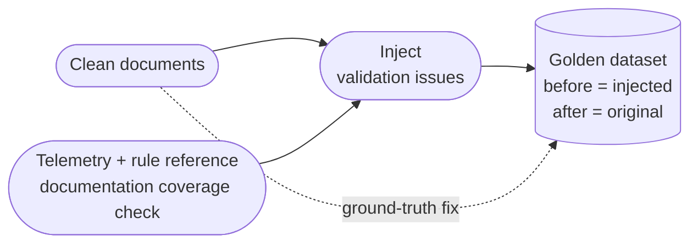
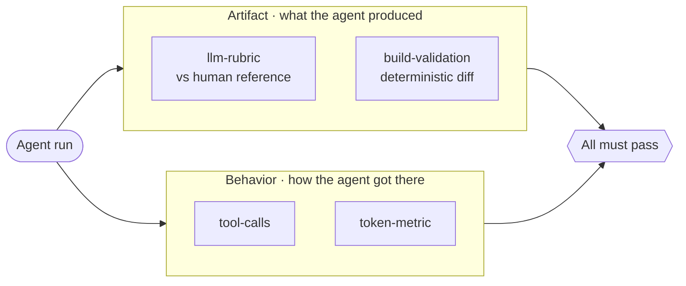
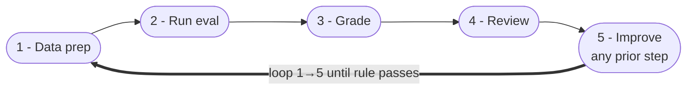

Most teams building AI agents over a structured rule set end up in the same place: the agent works on a demo, ships to a pilot, and then quality wobbles in ways nobody can grade or reproduce. **The part that turns out to matter is not the agent — it's the evaluation system around it, and the speed at which you can iterate on that system.** We spent the last few months building one of these (an agent that automatically fixes validation errors in a large corpus of published documentation), and that lesson is the one I'd hand to anyone starting a similar project.

This note is about three design choices that, in hindsight, were the load-bearing ones.

## 1. Generate the dataset by *synthesis*, not *discovery*

The conventional approach to building an eval set is to go hunting in production: scan live data, find cases where the system misbehaves, label them, and add them to a regression suite. It's slow, it's biased toward whatever happens to be broken today, and — worst of all — there's no ground truth. When the agent produces a fix for a real broken document, *what does "correct" even mean*? A human labeler gives you one answer; another labeler gives you a different one; an LLM judge gives you a third. The grader becomes the bottleneck.

We inverted the problem. Instead of starting from broken inputs and chasing ground truth, we started from a vast corpus of documents that were already known to be clean, and synthesized each validation violation on top of them.

This solves four problems at once:

- **A built-in oracle for "good."** The *original* clean document is the ground-truth fix. It was authored by a human, it's free, and it's available for every case. The agent's job is to reconstruct it; the grader's job is to compare.
- **Determinism.** Synthesis gives you a clean before/after pair. No noise from unrelated issues tangled into the same document.
- **Composability.** You can dial variant counts per rule, combine error types, isolate edge cases, and add negative cases (the empty-file guardrail) on demand. The dataset is data-driven from config files, so adding a new rule is mostly a content-authoring task, not engineering.
- **Defensible coverage.** To avoid only testing "easy" synthesized cases, we cross-reference production telemetry and the official rule reference documentation to make sure every typical real-world pattern has a representative sample.

The dataset lives on per-case frozen branches, anchored to reference commits — immutable and reproducible.

If you take only one thing from this section: **the cheapest way to get a defensible oracle is to manufacture broken cases from known-good originals, not to discover broken cases in the wild.**

## 2. Grade the *agent*, not just the LLM call

A synthesized dataset gives you ground truth, but ground truth only matters if the grader knows what to do with it. And graders for *agents* — systems that decide which tools to call, in what order, against which files, over multiple turns — need to look very different from graders for single LLM calls.

Most LLM evaluation guides grade input → output. An agent is different. The same task can pass or fail based on *how* the agent got there (its trajectory — the sequence of tool calls it made along the way). A single-shot rubric will miss this entirely.

Our grader stack draws directly on Anthropic's [Demystifying Evals for AI Agents](https://www.anthropic.com/engineering/demystifying-evals-for-ai-agents) and adapts several of the patterns from there — in particular the "Swiss cheese" framing of layered, partially-overlapping graders, and the distinction between grading outputs and grading trajectories.

So we split the grader stack in two:

**Artifact graders** — what the agent produced:
- `llm-rubric` scores fix correctness, content preservation, diff minimality, and trajectory coherence — but, crucially, against the *original human-authored content* from Section 1. This dodges the LLM-grades-LLM circular trap: the rubric isn't comparing two model outputs, it's comparing the agent's output to a human reference.
- `build-validation` is fully deterministic. It diffs the system's validation report between baseline and the agent's PR, with `(file, code)` and `(file, code, line)` matching, and penalizes regressions. No LLM can fake this layer.

**Behavior graders** — how the agent got there:
- `tool-calls` checks the tool sequence and file-awareness (e.g. `view` before `edit`, edit only the violation file). It includes a *negative variant* that asserts `edit` is **never** invoked when the right behavior is to flag for a human reviewer.
- `token-metric` gates per-task token and turn budgets, treating agent thrash as a first-class quality signal. An agent that arrives at the right answer after thirty redundant tool calls is not a passing agent.

The principle: **no single layer is trusted on its own.** Each grader exists because one of the others can be fooled. The `llm-rubric` can be talked into a passing score by a confident-but-wrong agent; `build-validation` can't. `build-validation` doesn't care about content quality as long as the violation disappears; `llm-rubric` does. `tool-calls` catches "the agent did the right thing for the wrong reasons" — including the *never-do-this* invariants that prompt-only mitigations drift away from across model versions.

If you take only one thing from this section: **agent evals are not LLM output grading with tool traces attached for debugging. The trajectory needs its own pass/fail graders, running in parallel with the artifact graders — and both tracks must pass.**

## 3. Agentize every step of the iteration loop

A good dataset and a layered grader stack only pay off if you can run them repeatedly and cheaply. This is the section that compounded the hardest — and the one whose importance is easiest to underestimate up front.

The core observation: **an AI agent is not a static artifact you design once and ship. It only gets good through iteration.** Every meaningful quality gain we made — fix correctness from 0% to over 90%, the elimination of hallucinated edits on empty files, the trajectory discipline that stopped the agent from touching unrelated files — came from running the loop, looking at what failed, changing one thing, and running it again. None of it came from a clever up-front design. So the speed of that loop *is* the speed at which the agent improves. Halve the loop time and you double the rate of improvement; agentize a manual step and you compound it.

This is why I'd put "agentize the iteration loop" above almost any other engineering investment for a team building an agent. The model is going to keep changing under you. The prompt is going to keep changing. The rules, the data, the graders — all of it is in motion, and loop speed is what lets you keep up.

Early on, one full cycle of *generate dataset → run eval → review failures → improve* for a single new rule took about **three days** of mostly manual work. Today the same loop runs in roughly **one hour per rule** — a compression that is the only reason it was realistic to bring a dozen-plus rules to production quality in weeks instead of months, and that compounds across every future rule we add.

The single biggest lever was wrapping each step a human used to do — dataset generation, eval execution, failure triage, per-rule knowledge-base lookup, fix-guidance updates — as an agent-callable skill. And just as importantly, we made them *compose*, so a failure surfaced by one skill flows straight into the next without manual glue.

The deeper principle: **the highest-leverage thing to agentize is whichever step a senior engineer keeps having to do by hand, and the way to make it stick is to package each step as a small, composable, agent-callable skill rather than a bespoke one-off automation.** This pattern is converging across the industry — OpenAI's [Skills in the Agents SDK](https://developers.openai.com/blog/skills-agents-sdk) post describes the same playbook applied to a different bottleneck, agentizing the recurring engineering chores around their own SDK (verification, release review, integration testing, PR drafting), routing deterministic shell work to scripts and reserving model judgment for interpretation.

What used to be a human stitching together notebooks, scripts, and copy-pasted reports is now an agent walking the pipeline end-to-end with the human in a review seat.

The slowest step — running the eval itself — we attacked head-on:
- Parallel execution and smaller checkouts cut a full sweep from ~45 to ~25 minutes.
- Task-ID filtering drops partial re-runs to seconds.
- A local harness mode (the harness being the wrapper that drives the agent end-to-end and applies the graders) runs everything on a developer machine directly — in our case, using the GitHub Copilot SDK to drive Copilot locally instead of going through the hosted Copilot service the production path uses. Same task definitions, same graders, no network in the inner loop, no remote rate or capacity limits during heavy iteration.

The natural next step we're exploring is *AI-powered self-improvement*: because every step of the loop is already agent-ready, a companion agent can drive the full cycle — propose prompt and knowledge-file changes from review-report patterns, run the eval, surface the deltas for a human to ratify, and close the flywheel end-to-end. This is the same shape as Karpathy's [autoresearch](https://github.com/karpathy/autoresearch), where an agent autonomously edits a training script, runs a short eval, keeps or discards the change, and repeats — with the human shaping the meta-prompt rather than each individual experiment. Different domain, same flywheel.

**Bottom line: how fast and cheaply you can spin the loop is the strongest single predictor of agent quality. Every manual step inside the loop is paying compounding interest until you agentize it.**

## Takeaways

Three principles, each spanning more than one of the sections above:

- **Close the eval loop as early as possible, then iterate every part of it.** Good data, graders, prompts, and review processes don't come from up-front design — they converge through cycles of running the loop and fixing whichever part hurts most. The gains we saw came from many small iterations across all five buckets (*data* from §1, *grader* from §2, and *agent-prompt, fix-guidance, harness* from §3), not from any single architectural decision.
- **Agentize every engineering step, especially inside the eval loop.** Wrap each step a human does once as a composable agent-callable skill. Anywhere you're stitching scripts and notebooks by hand, that's the next thing to agentize — and it sets up a companion agent to eventually drive the loop with the human in a review seat.
- **Guard edge and negative cases in evaluation, not just the prompt.** "Does the agent know when *not* to act?" is a first-class quality question for any system touching production content. Prompt-only mitigations drift across model versions. Encode the *never-do-this* invariants as negative test cases plus graders that assert no edits happen when the right behavior is "flag for a human."

## Closing

Looking back, the meta-pattern is this: every time we tried to make the agent itself smarter, the returns were modest. Every time we tightened the *loop around* the agent — better data, better graders, faster iteration — the returns compounded.

That's the thing I'd hand to anyone starting a similar project. Build the evaluation system first. Build it so you can run it in your sleep. The agent will follow.
