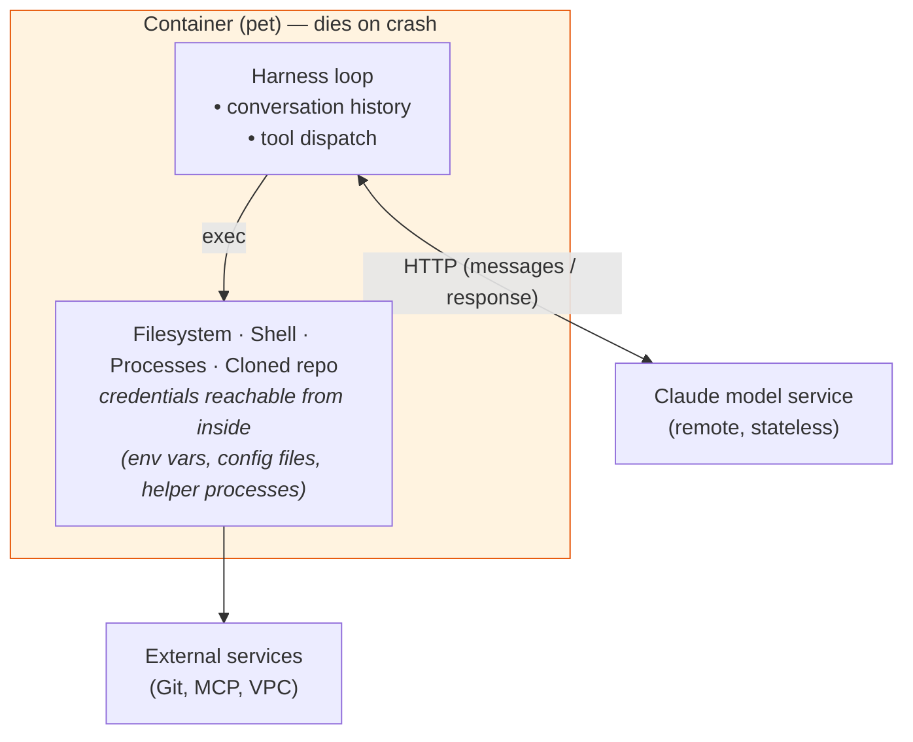
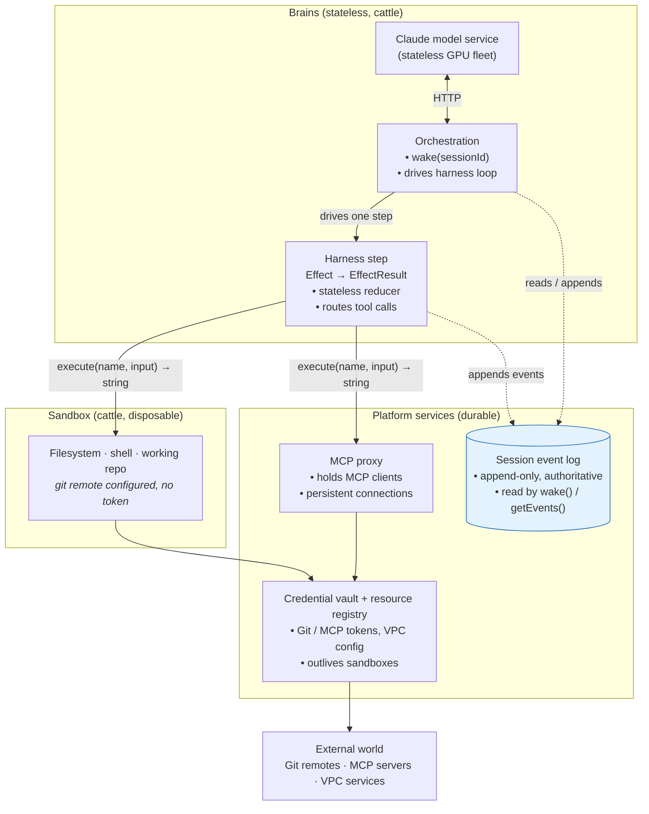

> *Read through an OS lens,* **Managed Agents is a microkernel for agents** — a tiny trusted core mediating between disposable workers, ephemeral environments, and a remote oracle.

## TL;DR

- Anthropic's [*Scaling Managed Agents*](https://www.anthropic.com/engineering/managed-agents) re-architects agent runtimes by borrowing one move from cloud infra: **externalize state, and the thing that held it becomes disposable.** Apply that recursively and a fragile "pet" container becomes a fleet of cattle.
- The redesign produces three primitives — **Session, Harness, Sandbox** — plus a vault-mediated **resource** layer. Read carefully, the harness is actually two layers: a per-step reducer and a session-level driver (orchestration).
- Headline wins: container failures stop killing sessions; harnesses can crash and resume; credentials never enter the agent's context; brains can pass sandboxes to one another (reviewer pattern, long-horizon work surviving brain churn). p50 TTFT ~60% lower, p95 >90% — driven by lazy sandbox provisioning, not the decoupling itself.
- Read through an OS lens, the whole design lands closer to a **capability-based microkernel** than to microservices — decomposition by lifecycle and trust zone, not by business function.

---

## Before: one container, one pet

The classical agent runtime puts almost everything into a single container. Claude inference itself has always been a remote HTTP service — the harness sends messages, gets a response back — but everything *else* lives together:

What lives in the container: **the harness loop, the conversation history it sends to Claude each turn, the working filesystem, and the credentials.** What lives outside: just Claude itself. Lose the container, lose the agent.

---

## The problems with the "pet" design

Five classes of pain follow from the coupling.

| Class | Mechanism | Why it hurts |
|---|---|---|
| **Evolvability** (article's lead motivation) | Harness bakes in workarounds for *current* model quirks (e.g., context-reset logic for Sonnet 4.5's "context anxiety"). | The harness and container are entangled; you can't upgrade the model without churning the runtime, and yesterday's workaround becomes dead weight on Opus 4.5. |
| **Reliability** | Container holds the conversation, the environment, and in-flight work — all in one process. | Any container failure is a *session* failure. You can't restart the container without losing the agent. |
| **Security** | Credentials are reachable from inside the sandbox — env vars, config files, helper processes. | A prompt-injected agent can escalate *delegation*: same auth flow, different actor and intent (see threat-model appendix). |
| **Debuggability** | Only outside-the-box signal is a WebSocket event stream; user data lives in the same container as the runtime. | Harness bug, dropped packet, and container offline all look the same. Shelling in to investigate exposes user data, so in practice the team *couldn't* debug. |
| **Scalability** | Containers must be pre-warmed and pinned to long-lived sessions; VPC integration forces presence everywhere. | You pay provisioning cost up front and keep paying for idle capacity. |

The diagnosis: the runtime and the model are evolving on different clocks, but the design entangles them. Same for runtime vs. credentials, runtime vs. environment, runtime vs. observability.

---

## The method: pets → cattle, applied recursively

The fix is one move borrowed from how the data-infra industry escaped snowflake servers a decade ago:

> **Find the load-bearing state. Externalize it. The thing that used to hold it becomes disposable.**

Applied once, you fix one pet. The article's insight is to apply it **three times in sequence**, at three different layers:

| Move | What externalizes | What becomes cattle | Win |
|---|---|---|---|
| 1. Harness leaves sandbox | Harness state → out of container | **Sandbox** | Container failures surface as tool errors, not session deaths. (TTFT wins come from the lazy-provisioning consequence, not this move directly.) |
| 2. Session log leaves harness | Session state → durable log | **Harness** | Any harness can `wake(sessionId)` and resume; harnesses scale/upgrade/restart independently. |
| 3. Credentials leave sandbox | Tokens → vault, accessed via host-side wiring (git remote, MCP proxy) | **Credentials** | Sandbox holds no secrets; tokens persist across container churn. |

After all three: **only the sandbox holds disposable in-memory state and working-copy data.** Everything else is stateless or externally durable.

---

## After: the full picture, reassembled

Applying the three moves produces this topology:

Compare to the "before" diagram: what used to share one container is now grouped by **lifecycle and trust zone** — stateless brains, disposable sandbox, durable platform services — talking through three interfaces: `Effect → EffectResult`, `wake(sessionId)`, and `execute(name, input) → string`.

The **session event log** sits off the request path on purpose. It's the durable write-ahead log everything replays from: `wake(sessionId)` reads it; the harness step appends to it. Orchestration and the log together are what make harnesses disposable.

---

## High-level characteristics of the new design

Two properties of the new design aren't obvious from the components alone and are worth stating before the OS-lens analysis.

**1. Stable interfaces, swappable implementations.** Three interfaces (`Effect → EffectResult`, `wake(sessionId)`, `execute(name, input) → string`) define the entire system. Anything behind them can change — model versions, harness logic, sandbox runtimes, credential mechanisms — without forcing changes elsewhere. The article's lead motivation (decoupling the model's evolution from the harness's) is one instance of a more general property.

**2. Sandboxes as first-class transferable resources.** Because the sandbox is decoupled from any particular brain or session, it can be **passed between brains**. The OS analogue is file-descriptor handoff (`SCM_RIGHTS`, `dup2`) raised to the agent layer. What it enables:

- **Specialist handoff** — planner sets up the workspace, hands it to a coder with fresh context.
- **Reviewer pattern** — implementer hands the finished sandbox to a reviewer with no prior context to anchor on.
- **Long-horizon work survives brain churn** — instead of throwing away environmental state when context fills, hand the sandbox to a successor brain.
- **Human-in-the-loop with state** — pause, let a human edit the sandbox, resume.

The deepest implication: **"the agent" stops being a single coherent thing.** Long-horizon tasks become sequences (or graphs) of short-lived brains relayed through shared state. Continuity of state without continuity of mind.

---

## Why this shape: the OS lens

Pets→cattle explains *why* the redesign exists. The OS lens explains why the *shape* hangs together.

The components map cleanly onto primitives operating-system designers have been refining for fifty years:

| Managed Agents | OS primitive | What carries over |
|---|---|---|
| **Session** | Process | Durable identity (`sessionId` ≈ PID); authoritative state held externally; suspend and resume via `wake()` like a process being paged out and back in. |
| **Session event log** | Write-ahead log | Authoritative state on disk; everything in memory is a cache derived by replay. |
| **Harness step** | Syscall handler | Stateless per-invocation function: request → effect → result. |
| **Orchestration (`wake(sessionId)`)** | Process scheduler | Decides when a session runs; resumes it after preemption. |
| **Sandbox** | Container / namespace / address space | Isolated execution environment; swappable. |
| **Tool (`execute(name, input) → string`)** | Syscall | Uniform narrow interface that hides implementation — the "everything is a file" trick at the agent layer. |
| **Credential vault** | Kernel keyring with capability passing | The agent gets the *ability to act*, never the raw secret. Logs, transcripts, file reads all see nothing. |
| **Brain passes sandbox to brain** | File descriptor passing (`SCM_RIGHTS` / `dup2`) | The underlying object doesn't move; a transferable reference does. |

Each mapping is load-bearing, not decorative: the article ships a `wake()` primitive, lists "a container, a phone, or a Pokémon emulator" as interchangeable behind `execute`, and explicitly rejects token scoping for the same reason capability systems do — capabilities are about *who can invoke*, not *what damage scoping limits*.

The deepest move is recognizing the family. Once you see the design as a **microkernel for agents** — small trusted core (session log, credential vault, scheduler) mediating between disposable workers (harness steps), disposable environments (sandboxes), and a remote oracle (Claude) — the surprising-looking choices stop being surprising. Each one has a precedent.

The two frames work together: pets→cattle says *we had to externalize state to escape the pain*; the OS lens says *the shape you get when you do that has been understood since the 1970s, and the field already knows what good interfaces for it look like.*

The one thing the design's own naming hides: one word "harness" for two layers, and "brain/hands" obscuring that the harness reasons too. Once those layers are teased apart (see appendix), the architecture is unusually principled for current agent infra.

---

## References

- [Scaling Managed Agents](https://www.anthropic.com/engineering/managed-agents) — Anthropic, by Lance Martin, Gabe Cemaj, Michael Cohen.
- Background reading: [seL4](https://sel4.systems/), Plan 9 from Bell Labs, Unix file descriptor passing (`SCM_RIGHTS`), event sourcing / write-ahead logs, capability-based security.

---

## Appendix: layers that need extra clarification

The article covers Session, Sandbox, Tool, Resource, and Claude itself clearly enough — read the post for those. Three things deserve extra unpacking because the article either folds them together, soft-pedals them, or doesn't name them at all.

### Harness is two layers

The article uses "harness" for two distinct things. The interface fragments give it away:

- **Per-step:** `yield Effect<T> → EffectResult<T>` — a reducer. One turn of the wheel.
- **Per-session:** `wake(sessionId) → void`, `getSession(id)`, `getEvents()` — lifecycle.

These are different layers — a step function and the driver loop that keeps calling it. Calling both "harness" obscures why statelessness *buys* anything: a stateless step function can be driven by any orchestrator (local, remote, post-crash). If the harness owned the lifecycle, statelessness wouldn't matter.

Related sloppiness: **the harness reasons too.** Context compaction, subagent dispatch, routing, retries — many delegated back to Claude itself. "Brain vs. hands" reads as "intelligence vs. mechanism," but the harness is closer to a slow, stateful brain consulting a fast stateless one. A cleaner naming would be **Reasoner / Controller / Effector**.

### The credential threat model

It's tempting to read "Claude never handles the token" as a defense against leaking secrets into chat logs. The article frames it differently:

> "Once an attacker has those tokens, they can spawn fresh, unrestricted sessions and delegate work to them."

The worry isn't that a secret ends up in a transcript — it's that a prompt-injected agent (or Claude itself, behaving oddly) uses the credential *as intended* but for *unintended purposes*: spinning up new sessions, pushing to other repos, calling MCP tools the user didn't authorize. Same auth flow, different actor and intent.

This is why the article explicitly dismisses narrow scoping as a fix:

> "Narrow scoping is an obvious mitigation, but this encodes an assumption about what Claude can't do with a limited token — and Claude is getting increasingly smart."

The only structural defense is making sure **the credential is never reachable from the sandbox at all** — not in env vars, not in config files, not in any helper process the agent can inspect. The article confirms the high-level shape ("wire[d] into the local git remote," MCP via "a dedicated proxy") without specifying the precise mechanism; architectural constraints force something like a host-side credential broker or out-of-sandbox auth proxy. The exact implementation is less important than the invariant: **anything the agent can read, the agent can act on; therefore the token must be outside everything the agent can read.**

This is a notably stronger threat model than the credential-leak framing. It treats the agent itself as the potential adversary — not just as a leaky pipe — and that assumption only gets more load-bearing as models get more capable.

### Where the MCP client lives

The article rules out "in the sandbox" (tokens would leak) and implies it isn't in the harness either (stateless cattle; MCP wants persistent connections). The diagram's **MCP proxy** is the architectural-necessity answer: a platform-side service colocated with the credential vault, with the harness reduced to a thin router. Contrast Claude Code today, where the MCP client lives in the harness process holding tokens directly — fine for a local CLI, broken for a managed runtime.
