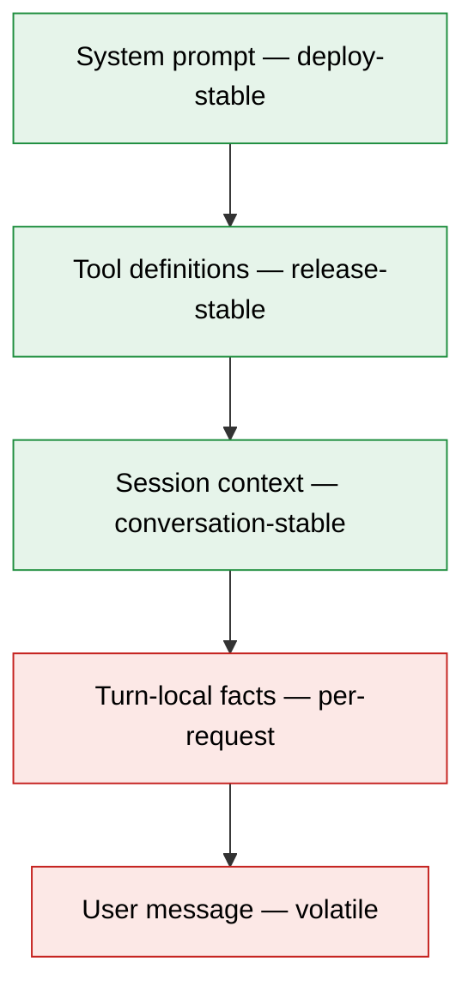
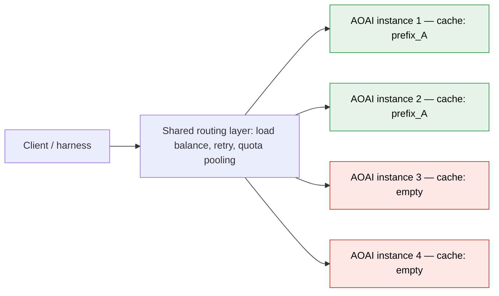

> *A cache hit is a property of the whole pipeline — from the routing layer above the model down to the order of bytes in a single rendered set.* **Treat any one layer as someone else's problem and your hit-rate quietly collapses while your bill quietly doubles.**

## TL;DR

- **Caching is an end-to-end discipline, not a flag.** Every layer — routing, prompt assembly, set rendering — has to cooperate; one weak layer cancels the rest.
- **At the prompt layer, determinism is the whole game.** `cache_control` does nothing if your prefix bytes drift between calls. Alphabetize sets, push timestamps below the cache boundary, and use two-tier dispatch so the model sees a stable tool surface.
- **At the architecture layer, pools defeat prefixes.** Shared routers scatter deterministic prefixes across instance-local caches. Fix the prompt and you still have this fight ahead of you.
- **Hit-rate is an SLI.** Log it per call, alert on regressions, and remember retention varies from 5 minutes to 24 hours.

## Why prompt caching matters

Caching pays back on two independent axes — either one alone justifies the work.

**Cost.** Cached input tokens are billed at a fraction of fresh ones — typically 10% on Anthropic, 50% on Azure OpenAI. When the system prompt, tool definitions, and session context dominate every turn (as they do in any agent or chat product), a healthy hit-rate is the difference between cumulative cost that grows linearly with turns and cost that grows quadratically: a miss re-pays for the entire prefix; a hit only pays for the new suffix.

**Latency (TTFT).** Cache hits skip the prefill phase — the part of inference that reads the prompt and builds the KV state before any output token can be emitted. Prefill scales with prompt length, so for a 6–10k-token prefix it usually *is* the dominant component of time-to-first-token. A warm prefix often cuts TTFT by 50–80% (model- and length-dependent) — the difference between a UI that feels conversational and one that feels like it is thinking. TTFT also compounds across agent-loop turns, so the gap widens with depth.

Once caching is load-bearing for either axis, the question becomes: is my pipeline actually earning the discount, or am I assuming a hit-rate I never receive? That question is what sent me into the prompt-assembly code in the first place.

---

## A case study: reading an assistant service's prompt-assembly path

I went in with one question: *what bytes does the model see, in what order, on consecutive turns?* The assembly looked fine on paper — system message, MCP tool list, a per-session context block, then the conversation turn — but the hit-rate was near zero and nobody had measured it.

Three structural problems at the prompt layer:

1. **Context block in selection order.** Whichever fields the resolver emitted first won. Same logical content, different bytes. Sorting alphabetically made the rendering a function of the set, not the iteration.
2. **Context block above the user turn but below the tool list.** Worst of both worlds: volatile enough to invalidate the suffix, stable enough that re-tokenizing it every call was waste. Fix: pin it into the cached prefix if it lives for the session, or push it below the cache boundary if it mutates.
3. **MCP tool list rendered directly into the prefix.** The tool list could change whenever the MCP server's registry changed — adds, removes, version bumps — and every change invalidated the cached prefix. Fix: **two-tier dispatch.** A small stable outer tool surface the model sees (curated in code, only changes on deploy), with a resolver below the LLM boundary that maps the model's choice to the actual MCP call. The cached prefix stopped depending on the registry's cardinality.

All three are flavors of the same mistake — letting something volatile sit inside what the cache treats as a stable prefix. Name the mistake and you get the first rule. Fixing all three still wasn't enough, though: the routing layer above the model was a fourth problem on its own. More on that below.

## Rule 1 — Stable prefix, volatile suffix

Every production prefix cache I have used — Anthropic's, Azure OpenAI's, Bedrock's — keys on the longest exact byte prefix it has seen. Model the prompt as layers, each strictly more volatile than the one above:



Anything that breaks monotonicity — a counter, a clock, a re-ordered set, a "helpful" trace id — relocates the cache boundary upward and burns tokens. The discipline is not "cache more"; it is "stop invalidating what you already cached."

Anthropic's docs make the same hierarchy concrete: cache keys are computed in the order `tools → system → messages`, and a change at one level invalidates that level and everything below it.[^anthropic] This is why a re-ordered tool list is so expensive — it invalidates *both* lower levels in a single move.

## Rule 2 — Alphabetize optional sets

The most common cache-killer is rendering a `Set<T>` as if it were a `List<T>`. Sets have no order; the renderer invents one — often "iteration order of a HashMap," which makes your cache key a hash of pointer addresses.

```python
def render_context(facets: set[str]) -> str:
    return "\n".join(f"- {f}" for f in sorted(facets))
```

Alphabetical isn't magic — it's the canonical order everyone agrees on without coordination. Sort tool definitions by name, memory snippets by id, field subsets by field name. Enforce the projection in exactly one place — the renderer, not the caller.

OpenAI's Codex team shipped this exact bug: *"our initial support for MCP tools introduced a bug where we failed to enumerate the tools in a consistent order, causing cache misses."*[^codex] Same surface, same fix, independently rediscovered.

## Rule 3 — Timestamps go last, or not at all

Memory systems love timestamps. "Most recent first" feels right. It also destroys the cache: every new memory shifts every older memory's byte offset.

Three viable shapes:

1. **No timestamp in the prefix.** Store it on the record; render only content. Inject "today is 2026-05-15" once at the bottom if the model needs the wall-clock.
2. **Stable-order memories, timestamp as suffix annotation.** Sort by id (creation order is append-only and stable); put the "as of" stamp in the turn-local layer.
3. **Bucketed staleness.** Group into coarse buckets ("this week", "older") whose boundaries move daily, not per turn.

Sorting by `updated_at desc` with inline timestamps guarantees a fresh miss on every turn.

## Hit-rate is a first-class metric

You cannot defend a property you do not measure. Every provider returns cached-token counts in the usage block; hit rate is cached over total input. Log per call, aggregate per route, treat regressions like any SLO breach.

The mechanics differ enough that an SLO has to name a vendor:

| Vendor / model | Min cacheable prefix | Default TTL | Hit field |
|---|---|---|---|
| Anthropic Sonnet 4.x | 1,024 tokens | 5 min (1h opt-in via `cache_control.ttl`) | `usage.cache_read_input_tokens` |
| Anthropic Opus 4.x, Haiku 4.5 | 4,096 tokens | 5 min (1h opt-in) | `usage.cache_read_input_tokens` |
| Azure OpenAI gpt-5.x | 1,024 tokens | 24h (default for newer models) | `prompt_tokens_details.cached_tokens` |

A prompt that misses Anthropic's 5-minute window may sit comfortably inside Azure's 24-hour retention. Constants drift across model releases — treat this as a snapshot and check the vendor docs.

Dashboard checklist:

- **Hit rate by route.** A new endpoint at 5% is a design smell, not a warmup curve.
- **Prefix length cached.** Shorter than your system prompt means something above it is moving — or you haven't crossed the per-model minimum.
- **Time-to-first-miss after deploy.** Deploys invalidate caches; mid-day cliffs are something else.
- **Retention awareness.** 5 minutes expires faster than most chat sessions; 24 hours survives overnight but still cold-starts on a fresh week.

Wire this into the same dashboard as p95 latency and token spend — it *is* the same dashboard. 70% hit rate on a 4k prefix is the difference between a profitable feature and a finance question.

## The bigger problem — pooled endpoints break cache affinity

Prompt-layer hygiene is necessary, not sufficient. Prompt caches are **instance-local**, and most production deployments don't call an instance — they call a pool.

A typical large-org setup puts a shared layer in front of the model: a router that holds capacity across many deployments (often Azure OpenAI instances across regions or subscriptions), load-balances, retries on throttling, and pools quota across teams. To the caller it is one endpoint. To the cache it is *N* independent caches, and each request lands on one by whatever policy the router uses — round-robin, least-loaded, random, or a hash that doesn't know about your conversation id.

The math is unkind. Uniform fan-out across *N* instances gives a per-turn hit rate of *1 − (1 − 1/N)^(k−1)* on turn *k*. For *N = 8* that's ~13% on turn 2, ~33% on turn 4, ~49% on turn 6 — even with flawless prefix discipline, roughly half of a 6-turn session still pays the full prefill bill.



Diagnostic signature: per-turn hit rate climbs along the *(1 − 1/N)^(k−1)* curve instead of saturating after turn 2. If turn 2 sits near *1/N* and turn 6 is still well below 1, the prefix is probably fine and the router is the culprit.

Two practical fixes:

- **Session affinity at the router.** Hash on conversation id; pin a session to one backend. Cheapest, biggest single win, often a config change. Cost: uneven load — chatty sessions concentrate, quiet regions idle.
- **Cache-aware routing.** Router keeps a short-TTL index of "which backend saw which prefix hash" and prefers that backend. Effectively CDN logic for prompts. Preserves load-balancing for cold traffic, warms for repeat traffic.

These trade fairness and complexity against each other based on session length, prefix stability, and how much of your bill is prefix tokens. Prompt-assembly fixes are *prerequisites*, not the destination — once the prefix is deterministic and the metric is honest, the architecture question above it becomes visible.

## Closing

A cache hit is a claim about determinism: same logical inputs, same bytes, same offsets, on the same backend, every time. The weakest layer sets the ceiling, which is why this is an end-to-end discipline and not a prompt-engineering trick. Design each layer so caching is the natural outcome, then measure to keep it that way.

[^codex]: OpenAI, [*Unrolling the Codex agent loop*](https://openai.com/index/unrolling-the-codex-agent-loop/) — an independent postmortem on the same patterns from a different team and stack.

[^anthropic]: Anthropic, [*Prompt caching*](https://platform.claude.com/docs/en/build-with-claude/prompt-caching) — `cache_control`, the `tools → system → messages` hierarchy, prefix minimums, and TTL options.
